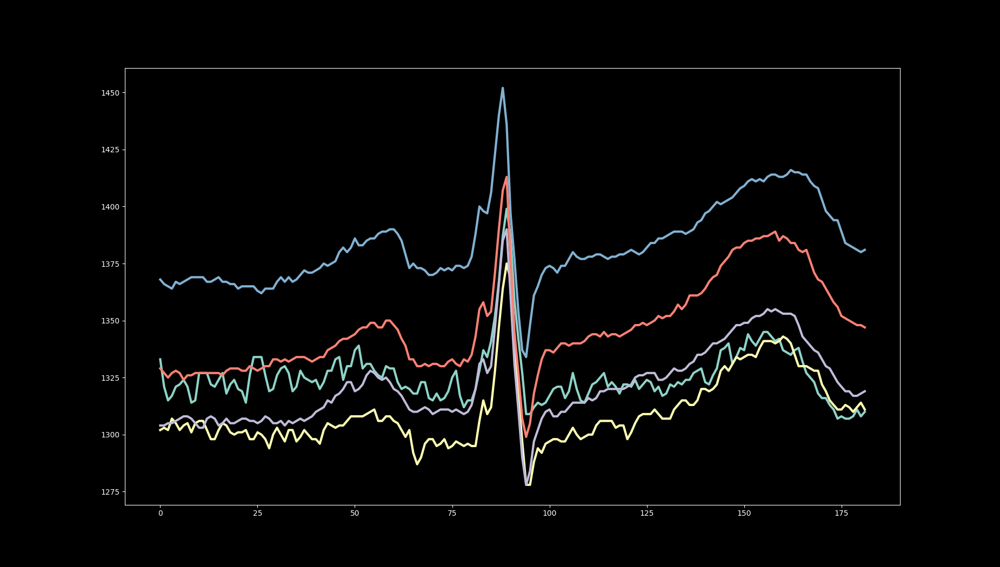
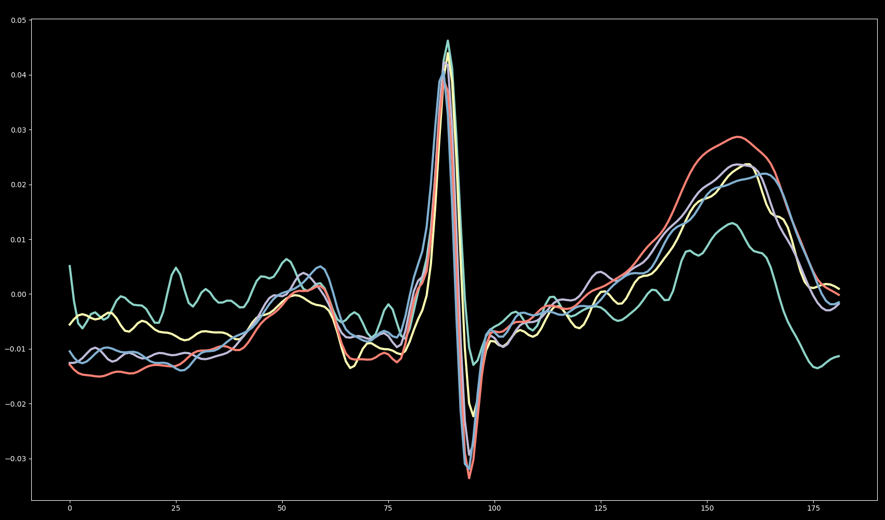
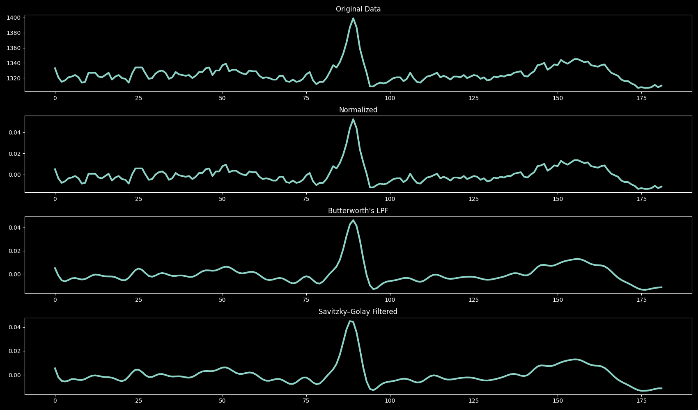
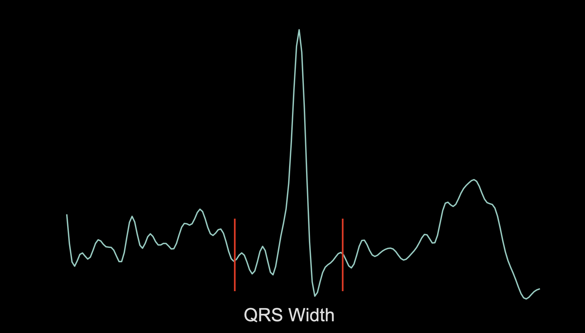
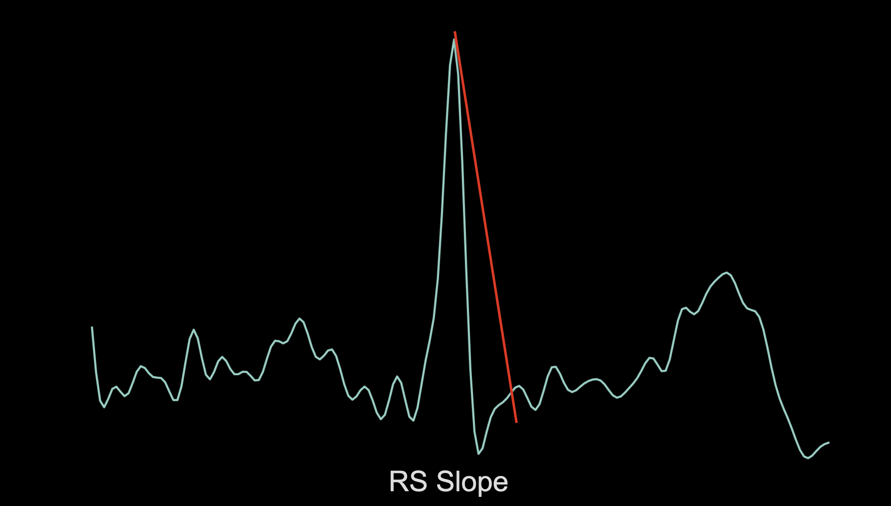
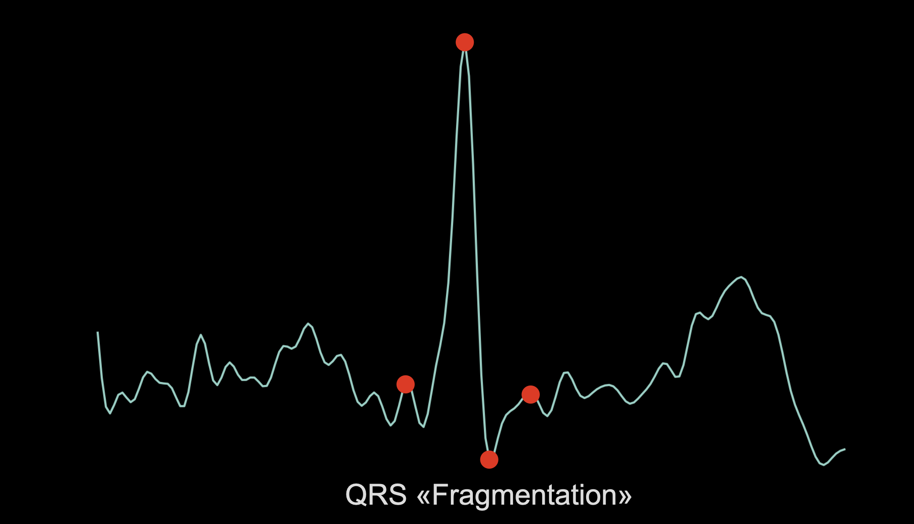
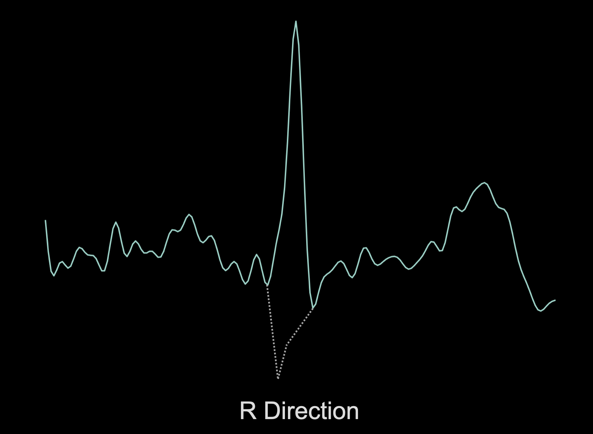
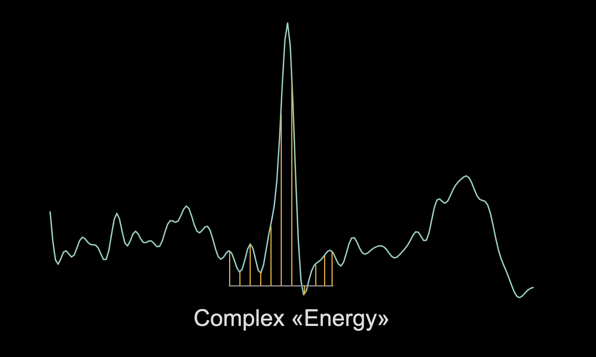
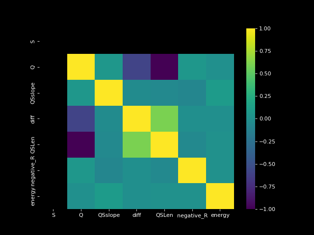
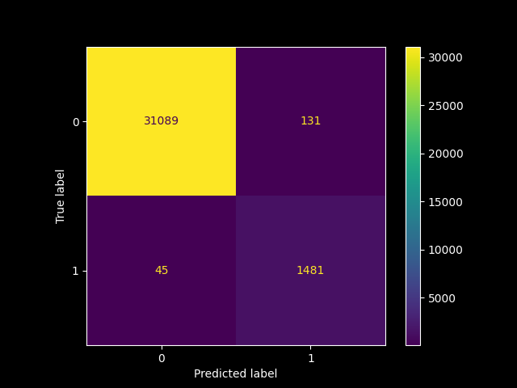

# Premature ventricular contraction detection & preprocessing

Aim of this course project is to create preprocessing the pipeline for ECG classification: normal or premature  ventricular contraction (PVC).

Raw data represented as sequence of samples saved in a CSV file. Figure below shows diffirent parts of that data:

</img>

## Preprocessing pipeline
Methods in **preprocessor** file used to slices QRS complexes, align them by isoline and smooth high frequency components. After preprocessing step, data looks like shown below.

</img>

Two approaches have been tested: filtration with Butterworth and Savitzky–Golay filter. 

</img>

Signal for both ways looks pretty the same, so it was decided to leave only one filter.

## Implemeted features

* QS Width 
</img>

* RS Slope 
</img>

* QRS "Fragmentation" 
</img>

* R Direction 
</img>

* QRS "Integral"
</img>

## Models
Following models have been tested:
* Logistic regression
* KNN
* XGBoost

Best results have been obtained in KNN model. Diagrams shows below.
## Achieved model results
Features heatmap:

</img>

Confusion Matrix:

</img>

